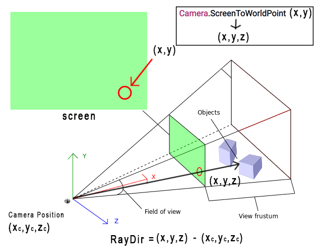

# EyeTrackingUnity
Eye Tracking or Gaze Tracking technique is getting popular recent years. Thanks to the state of art VR techs, some VRs offer high accuracy eye tracking. \
This is an experimental project that I test on Unity platform to explore some kinds of "playable" way with eye tracking techniques. 

近年、視線トラッキングの技術が注目されています。最新のVR技術のおかげで、いくつかのVRsは高精度の視線トラッキングを提供しています。
このプロジェクトは、視線トラッキングの技術を使って、「Playable」方法を探るために、Unityでテストしている実験的なプロジェクトです。

#### TODO
- [x] Build connection between the eye tracking app and Unity
- [x] Change TCP transmit to asynchronous function

## Problem Statement 可能な適用場所: 
In many racing games, we could switch our views from third-person to first-person. \
However, in first-person view, players usually have to look the actual 3D models of rear-view mirror or speedometer, which is, sometimes really hard to see. \
If we always show the big UI or big mirror on the screen that will somehow distract players. \
I think we may use eye tracking to display or zoom in the UI/Button/Models that users want to look. 

レースゲームでは、三人称視点と一人称視点の切り替えができるものが多いですね。\
でも、一人称視点だと、バックミラーやスピードメーターなど、実際の3Dモデルを見ないといけないので、見にくかったりするんですよね。\
もしかして、視線トラッキングを利用して、プレーヤーが見たいUIやボタン、モデルを表示したり、ズームインしたりすることができると思います。

## Pipeline/Workflow 方法: 
I'm using a Open Source software for eye tracking and transmit the eye position data to Unity game engine through TCP socket.\
オープンソースの[視線トラッキング](https://sourceforge.net/projects/gazepointer/)を使い、TCP SocketでUnityのゲームエンジンに視線データを送信しています。

[GazeFlow](https://gazerecorder.com/)
<pre>
<b>GazeFlow</b> ---→ <b>TCP socket</b>  --→ <b>Unity</b> 
</pre>

## TCP connection problem TCPの問題
Unity's TCP trasmission is slow. We need to make our TCP call a Async function by using Unity Coroutine. 

UnityでのTcp通信は本当に遅いです。\
約5回/秒 、つまり、 視点トラッキングデータの更新速度は5FPS\
ゲームのリフレッシュ・レートは60FPS\
Multitaskingを使用しないと、TCPが原因でゲームのリフレッシュ・レートが遅くなります。

```
StartCoroutine(TCPRoutine());
```
## Method 方法
Receives the 2D position on screen space and transform it to 3D space. Then shoot a ray to this direction from camera. Finally detect the collision.\
画面上の視線トラッキングの2次元位置を受け取り、3次元空間へ変換する。次に、カメラからこの方向へレイを発射する。最後にコリジョン検出。\


## Gameplay/Result 結果
##### Using eye tracking to zoom in the UI or Mirror when player watching.
##### 視線トラッキングを利用して、プレイヤーが見ているときにUIやミラーを拡大することができます。


--------
##### Because the camera capture is mirror-inversed, I manually inverse it back to the correct direction
<p float="left">


</p>

## Conclusion: 

I'm currently using TCP socket to transmit the data. It is really slow (5 frames/sec). It slow down game a lot so I have to change it to a multithread system.\
I think if the game engine has some built-in eye tracking system like VR, it would provide better result.

現在、TCPソケットを使用してデータを送信しています。本当に遅いんだ(20フレーム/秒)。そのため、マルチスレッドに変更する必要があります (Using "Async") 。
ゲームエンジンにVRのような視線トラッキングを組み込めば、もっと良い結果が得られると思うのですが。

